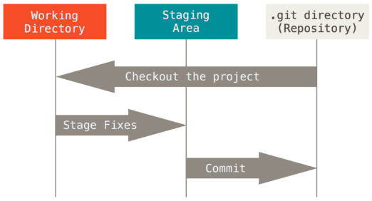

# Agenda

* Introdução GIT
* Instalação
* Configurando suas preferências
* Repositórios
* Criando um repositório GIT
* Repositório local
* Repositório remoto
* Hands On

# Introdução

* Ebook: https://git-scm.com/book/en/v2

* Qual a necessidade de um sistemas de versionamento?
  - Como detectar que estamos alterando o mesmo código que um colega?
  - Como mesclar as alterações que fizemos com a demais alterações da equipe?
  - Como identificar conflitos entre essas alterações?

* GIT x SVN
  - Sistemas de versionamento centralizados
  - Sistemas de versionamento distribuídos

* Git e GitHub são a mesma coisa?

* Por que GIT?

* Como é de praxe:
  - GIT foi criado em 2005 por Linus Torvalds (o mesmo criador do Linux, que estava descontente com o BitKeeper, o sistema de controle de versão utilizado no desenvolvimento do kernel do Linux)

# Repositórios

* Bitbucket
* GitHub - Rede Social para programadores

# Instalação

* $ sudo apt-get install git

# Configurando suas preferências

## Sua identidade

* git config --global user.name "Danilo Paiva"

* git config --global user.email danilopaivasilva@gmail.com

## Seu editor

* git config --global core.editor vim

## Listar suas configurações

* git config --list

# Criando um repositório GIT

## Criando um repositório em um diretório existente

Para transformar o diretório atual em um repositório do Git, basta exe-
cutar o comando:

* git init

## Clonando um repositório remoto

git clone https://github.com/danilopaiva/products-service-inc.git

# Repositório local

Criando um repositório local:

* git init

Rastreando os arquivos:

* git status

Adicionando um arquivo na área de Stage:

* git add

Ignorando alguns arquivos:

* .gitignore

Gravando os arquivos no repositório:

* git commit -m <mensagem>

Verificando o histórico do seu repositório:

* git log

Desfazendo mudanças não rastreadas:

* git checkout -- "file"

Desfazendo mudanças rastreadas:

* git reset -- "file"

# Desfazendo mudanças rastreadas mas voltando para o último commit:

* git reset --hard

# Desfazendo mudanças já comitadas

aaaa
# Repositório remoto

